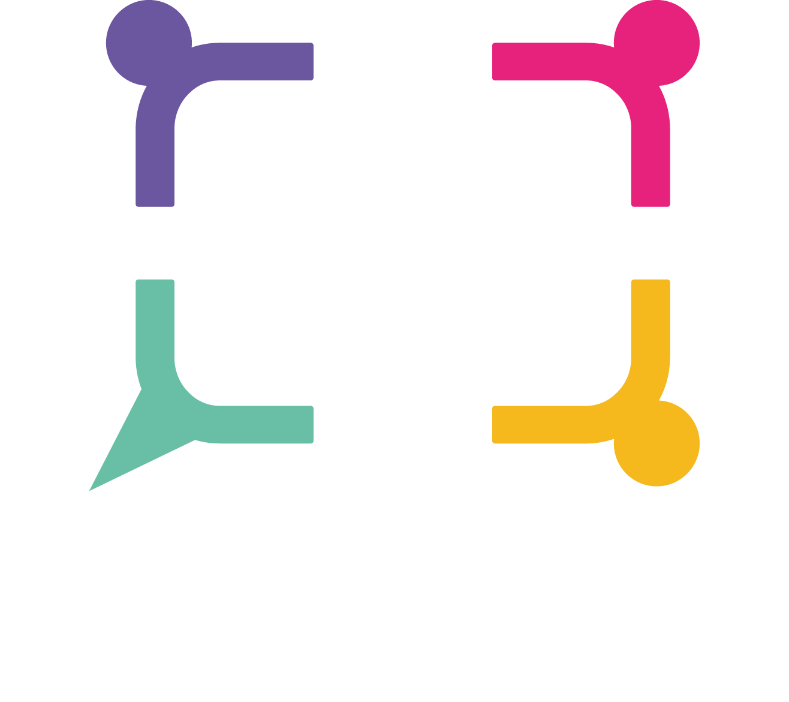

# Projet Synergy


---
### HOW TO LAUNCH THE PROJECT :

- Clone the project.
- Create a folder ```resources``` in ```main```.
- Add file ```application.properties``` with the following configuration :

```
spring.datasource.url=jdbc:postgresql://localhost:5432/**your database name**
spring.datasource.username=**username**
spring.datasource.password=**password**

spring.jpa.hibernate.ddl-auto=validate
spring.jpa.show-sql=true

springdoc.api-docs.path=/api-docs
springdoc.swagger-ui.path=/swagger-ui.html
```
---
### How To Get The API Documentation ?
1. Start Synergy-back
2. Access the url : http://localhost:8080/swagger-ui.html

### How to get the queries for the DB ?

In the file DB at the source of the project

### How to see the front of the project ?
1. Click this link : https://github.com/AyoubEchcharrat/Synergy-front/tree/main
